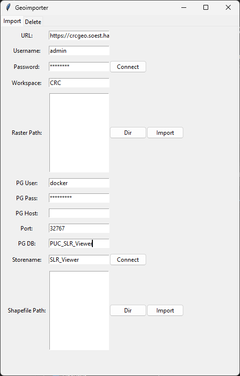

# Geoimporter

## About

Tool to import raster/shapefile layers into the Geoserver using Python package for Geoserver REST API. The interface is built with
tkinter GUI package. The tool allows users to set a directory for the layers to import and streamline the process of publishing the layers
on to the Geoserver application. The tool will go into every subdirectory and import only files with .shp or .tif extension. Shapefiles
are imported into a PostgreSQL/PostGIS DB, and then they are published on Geoserver. Therefore, the tool will need to be able to connect
to a PostgreSQL/PostGIS DB. The tool has been created to have a graphical interface for the importing scripts.

## Packages Used

- [tkinter](https://docs.python.org/3/library/tkinter.html)
- [geopandas](https://geopandas.org/en/stable/index.html)
- [sqlalchemy](https://www.sqlalchemy.org)
- [geoserver-rest](https://geoserver-rest.readthedocs.io/en/latest/)

## Requirements

Python 3.7 or higher
Python-3-dev Package
GDAL 3.2 or higher~

## Environment Setup

Execute `pipenv install` to install depending files

## Installing TK

### Windows

Tkinter should be a default packages that is installed in Python packages, so there should not be any further configuration.

### Debian-based Distro

You will need to install python tk package with command below:

```
sudo apt-get install python3-tk
```

Or you can build from source

source: https://tkdocs.com/tutorial/install.html

## Installing GDAL

### Windows

You will have to use an extension package for GDAL in order to run on Windows. Be sure to use the corresponding python version (ex. GDAL-3.4.1-cp39-cp39-win_amd64.whl for python version 3.9) Use the link below to download the file:

https://www.lfd.uci.edu/~gohlke/pythonlibs/#gdal

Run the code to install the extension

```
pip install D:\Downloads\GDAL-3.4.1-cpXX-cpXX-win_amd64.whl
```

You can also use Conda to install all of the dependencies for the project. However, if you intend on using PyInstaller, there will be conflicts between default conda packages and pyinstaller packages on **Windows**

Source: https://stackoverflow.com/questions/70892737/trying-to-install-gdal-python-3-9-9-pip-windows-10

### Debian-based Distro

https://mothergeo-py.readthedocs.io/en/latest/development/how-to/gdal-ubuntu-pkg.html

If you are running a linux distro, run the command below to install the correct GDAL version

```
ip install GDAL==$(gdal-config --version | awk -F'[.]' '{print $1"."$2}')
```

## Instructions



### Add Geoserver and Postgres Environment Variables

- Inside .env, input geoserver information for default value for text input.(Makes workflow quicker)

### Connect to Geoserver

1. Insert geoserver URL
2. Insert geoserver username
3. Insert geoserver password
4. Click connect
   Create Workspace if necessary
   4a. Insert workspace name in Workspace field
   4b. Click Create
   Import Raster Layer
5. Insert path inside field
   5a. Click "Dir" button
   5b. Navigate to path that the raster files are stored
6. Click Import
   Connect to PostgreSQL/PostGIS DB
7. Insert Postgres user
8. Insert Postgres Password
9. Insert Postgres host
10. Insert Postgres Port
11. Insert name of DB into storename field
12. Click DB Connect (Will Confirm connection)
13. Insert Shapefile Path
    13a. Click Dir
    13b. Navigate to path that the shapefiles are stored
14. Click Import
